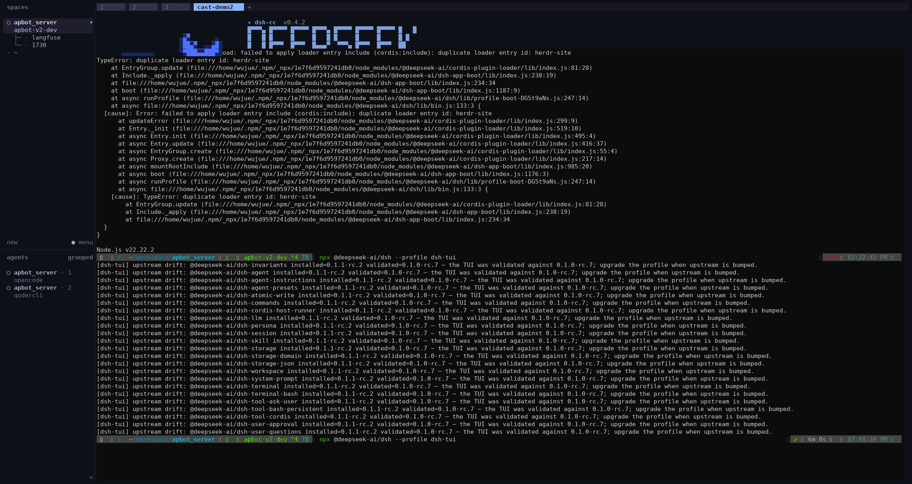
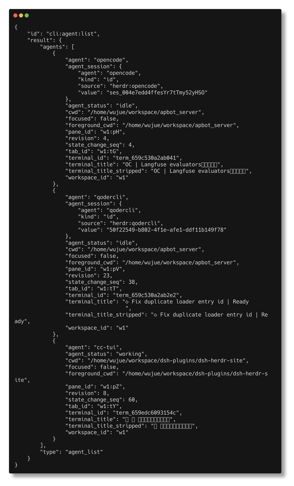
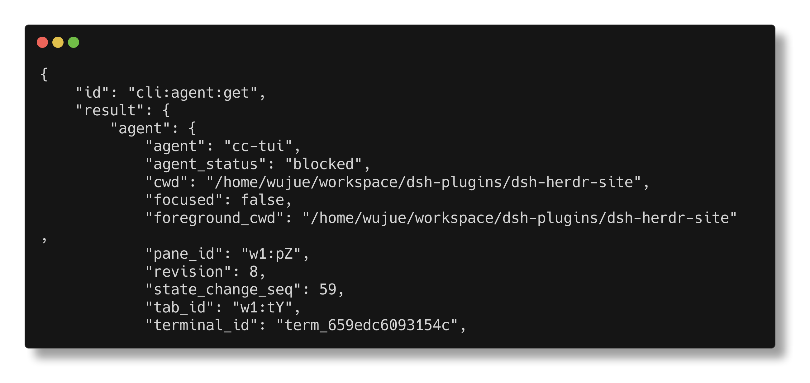

<div align="center">


# dsh-herdr-site

**让 Herdr 看懂你的 dsh agent**

dsh/cc-tui 面板不再是「不透明的黑盒终端」——working、idle、blocked 实时上屏，
面板跳转与 `--wait` 全部就位。尤其是模型停下来等你拍板的那一刻，一眼就能看见。

English | [简体中文](./README.zh.md)

`v0.1.0` · `MIT` · `DSH profile 插件`

</div>

---

## 💡 为什么需要它

> [Herdr](https://herdr.dev)（[GitHub: herdrdev/herdr](https://github.com/herdrdev/herdr)）
> 是一个面向 AI 编码 agent 的终端工作区管理器：把多个 agent 面板聚合在一处，
> 提供状态总览、面板跳转与 `--wait` 等待编排。它对「谁算 agent」的判定很严格。

- **Herdr 只认内置检测器**：opencode、claude、codex 都在名单里，dsh/cc-tui 不在——于是你的 agent 面板只是个普通终端进程，没有状态、没有跳转、不支持等待。
- **两态不够用**：dsh 的 `agent/status` 只有 running/idle，而「模型正通过 `ask_user_question` 等你回答」这个最关键的时刻，会被显示成 `working`——看起来在忙，其实在等你。
- **理想状态**：Herdr 的面板/agent 列表里，你的 dsh agent 与一等公民无异；需要人介入时立刻亮起 `blocked`。

## 👀 实际效果

全部画面来自一次真实运行的捕获，非手绘。

**完整生命周期实录**（[asciinema](https://asciinema.org) 录制，18 秒动图）——
提问后回合进行中显示 `working`，模型停在 `ask_user_question` 上时翻转为 `blocked`，
回答后恢复：



插件把它的生命周期上报给 Herdr。termshot 渲染的命令输出记录了完整状态机：
回合进行时 `working` → 模型停在 `ask_user_question` 上时翻转为 `blocked` →
回答问题后恢复。

**回合进行中** —— `herdr agent list`，cc-tui 面板显示 `working`：



**模型等待用户拍板** —— `herdr agent get`，状态翻转为 `blocked`：



被识别为一等 agent 意味着 Herdr 的面板跳转与 `--wait` 对 dsh 同样生效。
当模型在 `ask_user_question` 上等你回答时，面板会亮起 `blocked`（可选附带
`blockMessage` 说明原因）——这正是最需要被人看见的时刻。

## ✨ 核心特性

### 精准的状态映射

| dsh 信号                                        | Herdr 状态 |
|-------------------------------------------------|------------|
| `agent/status = running`（正在驱动一个回合）    | `working`  |
| `agent/status = idle`（没有活跃 driver）        | `idle`     |
| `ask_user_question` 挂起（模型等待人类回答）    | `blocked`  |

### 🚦 blocked 提升——本插件的灵魂

dsh 原生只有两态，但 Herdr 有三态。「等用户输入」恰恰是最值得单独亮出来的状态：
本插件从**持久化会话事件流**（`ask_user_question` 的 `tool/call` / `tool/result`）
推导这个信号，把 `running` 提升为 `blocked`——支持重放、不依赖任何 UI 钩子，
配合可选的 `blockMessage` 把等待原因直接写在 Herdr 面板上。

### 🧱 克制的工程

- 🙈 **Herdr 之外严格 no-op**：不在 Herdr 面板内就什么都不 spawn、什么都不读
- 🔁 **重放安全**：blocked 信号以 `callId` 关联，乱序、重放的事件流保持一致
- 📶 **单调 seq + 去重**：重复状态不刷屏，乱序上报被 Herdr 正确丢弃
- 🧹 **退场干净**：fiber 销毁时调用 `pane release-agent`，不留过期条目

协议遵循 [herdr 官方文档 —— Integrate your own agent](https://herdr.dev/docs/integrations/)：

```
"$HERDR_BIN_PATH" pane report-agent "$HERDR_PANE_ID" \
  --source custom:dsh-herdr-site --agent cc-tui --state <working|idle|blocked> \
  [--message …] [--seq N]
……fiber 销毁时调用 `pane release-agent`。
```

## 📦 安装

前提：已安装可用的 [dsh](https://github.com/deepseek-ai/deepseek-harness)，且带有
`dsh-cc-tui`/`dsh-base` profile —— 本插件把 profile 自带的包（`^4` 的
`@deepseek-ai/cordis`、`dsh-session`、`dsh-agent`）声明为 peer 依赖，由宿主 profile 提供。

```bash
dsh plugin --profile cc-tui add git+http://192.168.4.77:3000/dsh-plugins/dsh-herdr-site.git
```

包里声明了 `dsh.bundle.patch` 清单，安装器会自动把它加入 profile 的 bundle 层叠栈——
自带的 `cordis.patch.yml` 会把这个插件插入该 profile 启动的所有 surface。其他在用的
profile 同样操作一遍即可（例如 `dsh-tui`）。

确认已生效：

```bash
dsh --profile cc-tui --dump-config | grep -A2 herdr-site
```

也可以从本地检出安装：`dsh plugin --profile cc-tui add /path/to/dsh-herdr-site`

## ⚙️ 配置

可选的 `blockMessage` 覆盖，随 `blocked` 上报一并发送：

```yaml
# 写在 profile 的 cordis.patch.yml，或通过 --patch overlay
- id: herdr-site
  config:
    blockMessage: '模型等待你的回答'
```

## 🔨 构建与测试

```bash
npm install            # 开发依赖：@types/node
npm run build          # 输出 lib/
npm test               # 用桩 herdr CLI 做行为断言
npx tsc --noEmit       # 类型检查
```

git 安装无需构建：`lib/` 已提交入库——pnpm 默认拦截 `prepare` 构建脚本，
若依赖安装期构建会导致开箱即坏。

`test/smoke.mjs` 在真实 cordis context 上驱动编译产物跑完整生命周期——
working/blocked/idle 转换、去重、seq 排序、无关 tool 结果、销毁时释放——
并对照桩 `herdr` 二进制逐条断言发出的每一条 CLI 调用。

## 🛠️ 本地开发备注

用普通 `file:` 依赖对着真实 profile 开发有两个坑（都是实际踩过的）：

1. `file:` 依赖在安装时刻复制内容——每次重新构建后要在 profile 里重跑
   `pnpm install`，否则 profile 一直跑的是旧副本。
2. 当依赖既作为 bundle 层安装、又手工写了 insert 行时，实测裸包名激活会被静默跳过；
   把 insert 行的 `name:` 指到绝对路径 `lib/index.js` 是可靠的开发期接线方式：

   ```yaml
   - insert:
       - id: herdr-site
         name: '/absolute/path/to/dsh-herdr-site/lib/index.js'
         config: {}
   ```

   走这条路的话，还要把包从 profile 的 `dsh.profile.bundles` 列表移除，
   避免两处 insert 冲突。

以上两条都不影响标准 `dsh plugin add` 流程，后者能正确解析自带 patch 里的裸包名。

## ⚠️ 已知限制

- Herdr 的*自动进程检测*依然不会把 dsh 进程识别为 agent（那需要更新 Herdr 内置的检测器）。
  本插件做的是状态上报，这正是 Herdr 自定义集成路径所覆盖的；配合免检测器的自定义上报，
  Herdr 能正确显示 working/idle/blocked、面板跳转和 wait。
- 可选的 `--agent-session-id` 引用尚未接线，所以 Herdr 的 pane/agent API 暂时拿不到关联的
  dsh 会话 id。自动会话恢复还额外要求 Herdr 知道如何启动 dsh——这不在本插件范围内。
  状态上报是无论如何都稳赚的部分。

## 📄 许可证

[MIT](./LICENSE)
